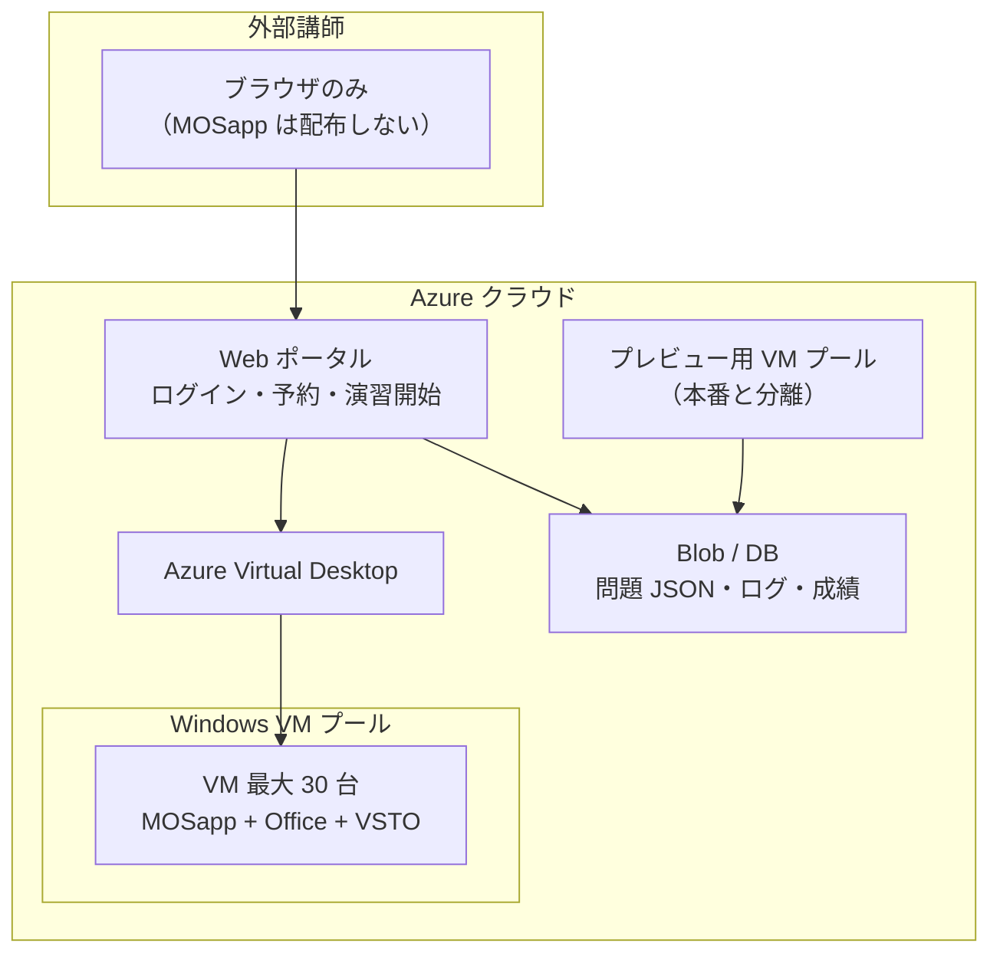

# MOSapp クラウド・ブラウザ運用案（外部講師向け）

社外秘の MOS 模擬アプリを **利用者にダウンロードさせず**、**ブラウザから利用**できる構成案です。  
外部講師の事前確認要望、クラウド運用、同時利用約 30 人を前提に整理しています。

---

## 1. 要件整理

| 項目 | 内容 |
|------|------|
| 利用者 | **外部講師のみ**（社内一般ユーザーではない） |
| 社外秘 | MOSapp 本体・問題データを **講師 PC に配布しない** |
| 事前確認 | 講師が本番前に **操作・採点フローを確認**したい |
| データ | **クラウド**上で管理したい |
| 同時利用 | 最大 **約 30 人** を想定 |
| 現行資産 | WPF + デスクトップ Office + VSTO + COM 採点を **できるだけ流用** |

---

## 2. 現行 MOSapp の技術構成（概要）

現行アプリは **Windows デスクトップ専用** で、ブラウザ単体では動作しません。

### 2.1 全体構成

```
MOSapp.exe（表紙・WPF / .NET 4.7.2）
    ├─ MOSExcelMogiApp.exe（Excel・WPF / .NET 4.8）
    ├─ MOS Word app.exe（Word・WPF / .NET 4.8）
    └─ Mos PowerPoint Mogi App.exe（PowerPoint・WPF / .NET 4.8）

各科目アプリ
    ├─ Microsoft Office デスクトップ版（COM オートメーション）
    ├─ VSTO アドイン（ExcelAddIn1 / New_MOSWordVSTOAddIn / PowerPointAddIn1）
    ├─ Checker DLL 群（Office Interop で採点）
    ├─ Win32 API（ウィンドウ配置・前面化）
    └─ 問題文 JSON（References/JSON 等）

配布: ClickOnce + VSTO インストーラ + 統合 setup（PUBLISH.md 参照）
```

### 2.2 技術スタック一覧

| レイヤー | 技術 |
|----------|------|
| UI | WPF（XAML + C#） |
| ランタイム | .NET Framework 4.7.2〜4.8 |
| Office 連携 | COM オートメーション（`Microsoft.Office.Interop.*`） |
| 採点補助 | VSTO アドイン（Excel / Word / PowerPoint） |
| ウィンドウ制御 | Win32 API（`SetWindowPos` 等） |
| 採点ロジック | 科目別 Checker DLL |
| 問題データ | JSON |
| 配布（現状） | ClickOnce、VSTO、統合 setup.exe |

### 2.3 動作の流れ

1. WPF の **AppBar（問題表示バー）** を画面上部に表示
2. **ローカルの Office** を起動・前面化
3. 演習用ファイル（`.xlsx` / `.docx` / `.pptx`）を開く
4. 受講者（講師）が **本物の Office UI** で操作
5. Checker DLL + VSTO がドキュメント状態を読み取り採点

### 2.4 ブラウザのみでは動かない理由

- デスクトップ版 Office・COM・VSTO は **ブラウザのサンドボックス外** の機能
- MOS 本番相当の操作・採点は **デスクトップ Office 前提** で実装されている
- 現行コードをそのまま Web に載せることはできない

---

## 3. 推奨構成：Azure Virtual Desktop（AVD）

**結論:** 社外秘を守りつつブラウザ利用するなら、**クラウド上の Windows VM で MOSapp を動かし、講師はブラウザから接続する**方式が最も現実的です。

### 3.1 アーキテクチャ図



### 3.2 推奨理由

| 要件 | AVD の適合 |
|------|-----------|
| 外部講師のみ | Entra ID **B2B ゲスト**で招待可能 |
| ダウンロード禁止 | アプリ・問題データは **VM 内のみ** |
| 事前確認 | **プレビュー用ホストプール**を別途用意可能 |
| クラウド | Azure 上に一元化 |
| 同時 30 人 | ホストプール + **自動スケール**で対応 |
| 現行アプリ流用 | WPF + VSTO + Checker を **ほぼそのまま**使用 |

---

## 4. プレビュー環境と本番環境の分離

外部講師の「事前に使用・確認したい」要望は、**本番データと切り離したプレビュー環境**で満たします。

| 環境 | 用途 | コンテンツ例 |
|------|------|--------------|
| **プレビュー** | 操作感・画面・採点フローの確認 | サンプル問題のみ、透かし入り類題、一部 Project のみ |
| **本番** | 実際の講義・演習 | フル問題 JSON、本番用演習ファイル |

### 4.1 運用フロー（例）

1. 講師に **B2B ゲストアカウント**を発行
2. Web ポータルで「**プレビュー演習**」を選択 → プレビュー用 VM に接続
3. 問題文・採点・AppBar の動きをブラウザ経由で確認
4. 本番日は「**本番演習**」から同じ手順で接続（別プール or 別問題セット）

### 4.2 社外秘ポリシーの選択肢

| 方針 | 内容 |
|------|------|
| 厳しめ | プレビューは Project1 の 1 セットなど **限定公開** |
| 標準 | **類題のみ**プレビュー可、本番問題は当日まで非表示 |
| ゆるめ | 本番と同内容をプレビュー可（漏洩リスク増・非推奨になりやすい） |

---

## 5. 同時利用 30 人の設計

MOS 模擬試験は **1 人 1 台の Office** が安定します（VSTO・COM・ウィンドウ制御のため、RDS 多セッション共有は非推奨）。

| 方式 | 30 人同時 | 備考 |
|------|----------|------|
| 1 ユーザー 1 VM | 最大 30 台を常時 or オンデマンド起動 | 最も安定、コスト高め |
| ホストプール + 自動スケール | ピーク時 30 台まで拡張、アイドル時削減 | **コストと安定のバランス◎** |

### 5.1 VM スペック目安（1 台あたり）

- **Standard_D4s_v5** 程度（4 vCPU / 16 GB RAM）
- Office + Excel/Word/PPT 同時利用のため、2 vCPU 以下は避ける

### 5.2 コストの考え方

- 30 台を **24 時間常時稼働**するとコストは高額
- 講義は週数回・数時間想定なら **自動シャットダウン + スケールアウト**で削減
- **Office ライセンス**（Microsoft 365 Apps / Office LTSC）は VM 料金とは別途設計

### 5.3 代替候補：Azure Lab Services

教室・研修向けのマネージド VM サービス。ブラウザ接続・テンプレート VM に向くが、カスタム VSTO や細かいポリシーでは AVD より制約が出やすい。**第一候補は AVD**、簡易パイロットのみ Lab Services も検討可。

---

## 6. 外部講師向け：認証とアクセス制御

| 項目 | 推奨 |
|------|------|
| 認証 | **Microsoft Entra ID B2B**（講師メールをゲスト招待） |
| 有効期限 | コース終了後にゲスト無効化 |
| 入口 | 専用 URL のみ（例: `https://learn.example.com`） |
| MFA | 可能なら必須 |
| 持ち出し防止 | クリップボード・USB・ローカルドライブのリダイレクト **OFF** |
| 配布物 | 講師には **URL とアカウントのみ**（setup.exe・JSON は渡さない） |

---

## 7. クラウド上のデータ配置

| データ | 置き場所 | 運用 |
|--------|----------|------|
| 問題 JSON | **Azure Blob**（暗号化） | VM 起動時に API 経由で取得、永続キャッシュしない |
| 演習ファイル（xlsx/docx/pptx） | VM **一時フォルダ** | セッション終了で削除 |
| 採点結果・ログ | **Azure SQL / Cosmos DB** | Web ポータル・管理者が参照 |
| MOSapp バイナリ・VSTO | VM **ゴールデンイメージ** | 講師には配布しない |

現行の `References/JSON` 同梱モデルから、次のいずれかへ移行します。

- **方式 A:** Publish 一式を VM イメージに焼き込む（シンプル）
- **方式 B:** 起動時に Blob から問題 JSON を同期（更新が容易）

---

## 8. Web ポータル（推奨）

必須ではないが、外部講師運用ではあると便利です。

- B2B ログイン
- **プレビュー / 本番** の切り替え
- 「演習開始」→ AVD セッション起動（ワンクリック）
- 簡易マニュアル・接続手順
- （任意）予約枠・同時接続数の表示

演習画面そのものは AVD のリモートデスクトップ（ブラウザ or 軽量クライアント）です。

---

## 9. 他案との比較

| 案 | exe 配布 | ブラウザ利用 | 現行アプリ流用 | 社外秘 | 実装難易度 |
|----|---------|-------------|--------------|--------|-----------|
| **1. AVD / Cloud PC** | 不要 | ◎ | ◎ | ◎ | 中 |
| **2. 自社 RDS + HTML5** | 不要 | ◎ | ◎ | ◎◎（オンプレ） | 中〜高 |
| **3. Web ポータル + リモート** | 不要 | ◎ | ◎ | ◎ | 高 |
| **4. Office Online 全面再実装** | 不要 | ◎ | × | ◎ | 非常に高 |
| **5. ClickOnce をブラウザから配信（現状延長）** | **必要** | △ | ◎ | × | 低 |

**本要件（外部講師・ダウンロード禁止・クラウド）では案 1（+ 将来的に案 3）が最適です。**

---

## 10. 導入ロードマップ

### フェーズ 1：パイロット（1〜2 週間）

- VM **1 台**に現行 Publish 一式をインストール（`PUBLISH.md` 手順）
- 講師 **1〜2 名**でブラウザ接続テスト
- プレビュー用問題のみで操作・採点確認

### フェーズ 2：プレビュー環境（2〜4 週間）

- プレビュー用ホストプール + B2B ゲスト発行
- Web ポータル最小版（ログイン + 演習開始リンク）
- 講師向け「事前確認手順」ドキュメント整備

### フェーズ 3：本番（最大 30 人）

- 自動スケール（最大 30 VM）
- Blob + DB 連携、セッション終了時のデータ消去
- 監視・アラート・コスト上限設定

---

## 11. セキュリティ・運用上の注意

1. **スクリーンショット・撮影**  
   リモート接続でも完全防止は困難。透かし（講師 ID）、利用規約、プレビューは限定コンテンツで対応。

2. **プレビューに載せる問題範囲**  
   社外秘レベルに応じ、類題・一部プロジェクトのみとするのが一般的。

3. **ネットワーク**  
   リージョンは **Japan East** 等、講師の所在地からの遅延を事前確認。

4. **初回接続サポート**  
   「ブラウザだけ」でも、ポップアップ許可・HTML5 クライアントの案内が必要な場合あり。

5. **Mac 利用**  
   ブラウザ経由の AVD なら Mac も可。ただし接続手順・推奨ブラウザの案内が変わる。

6. **セッション終了後**  
   VM の差分ディスク破棄 or プロファイル初期化で、演習ファイル・一時データを残さない。

---

## 12. 配らないもの・配るもの（まとめ）

### 講師に配らないもの

- MOSapp.exe / 各科目 exe
- VSTO アドイン（.vsto）
- 問題 JSON・類題データ
- 演習用 Office ファイルのローカルコピー

### 講師に配るもの

- 専用 URL
- Entra ID B2B ゲストアカウント（または招待リンク）
- 接続・プレビュー手順書

---

## 13. 次に決めること（設計具体化用）

| # | 決定事項 | 影響 |
|---|----------|------|
| 1 | プレビューに載せる範囲（全 Project / 類題のみ / 1 セットのみ） | 漏洩リスク・講師満足度 |
| 2 | 1 日あたりの利用時間・曜日 | VM コスト見積 |
| 3 | 講師 PC（Windows のみ / Mac も可） | 接続方式・サポート |
| 4 | Office ライセンス形態（ユーザー / デバイス） | 30 人分のライセンス設計 |
| 5 | 問題 JSON の更新頻度 | イメージ焼き込み vs Blob 同期 |

---

## 14. 関連リポジトリ文書

| ファイル | 内容 |
|----------|------|
| [MOSapp_ブラウザリモート実行_実装手順.md](./MOSapp_ブラウザリモート実行_実装手順.md) | **AVD によるブラウザリモート実行の具体的手順** |
| `PUBLISH.md` | 現行の発行・配布手順（VM イメージ作成時に流用） |
| `task/表紙単一exe＋VSTO統合setup_実行プロンプト.md` | 統合 setup の構成 |
| `task/VSTOについて.md` | VSTO の概要 |

---

## 15. 結論

| 項目 | 推奨 |
|------|------|
| アーキテクチャ | **Azure Virtual Desktop + クラウド上 Windows** |
| 講師の端末 | **ブラウザのみ**（MOSapp は一切配布しない） |
| 事前確認 | **プレビュー用 VM プール**を本番と分離 |
| データ | **Azure Blob + DB**、VM は一時利用 |
| 30 人同時 | **1 人 1 セッション + 最大 30 台スケール** |
| 認証 | **Entra ID B2B ゲスト** |

この方針により、**社外秘の維持・外部講師の事前確認・クラウド運用・同時 30 人**を、現行 MOSapp 資産を活かしつつ両立できます。
