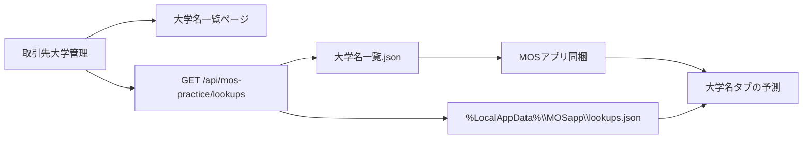

# MOS大学名一覧ページと初期JSONの作成手順

管理サイト（kouzakanri）に「大学名一覧」ページを作り、MOSアプリの予測候補にする。  
オフラインの教室PCでも使えるよう、**初期JSONをアプリに同梱する**ことを推奨する。

MOSアプリはWebページのHTMLを読まない。人が見るページと、アプリが読むJSON APIを分ける。



## 結論

- **初期JSONは作った方がよい。** 初回起動・オフライン・`baseUrl` 未設定でも予測が出る。
- **正本は取引先（大学）管理の `universityName`。** MOS専用マスタは増やさない。座席表・公開申込と表記がずれるのを防ぐ。
- 大学の追加・改名は取引先管理で行う。大学名一覧ページは閲覧（とJSONダウンロード）用。

## 1. MOSアプリが読むJSON形式

ファイル名・配置（MOSリポジトリ）:

- `MOSapp/MosPracticeClient/Assets/universities.json`
- ビルド時に各科目 exe の `Assets\` へコピーする（Excel / Word / PowerPoint）

形式は lookups API と同じ。

```json
{
  "universities": [
    {
      "name": "千葉商科大学",
      "classrooms": []
    },
    {
      "name": "和洋女子大学",
      "classrooms": ["本館101", "別館201"]
    }
  ]
}
```

ルール:

- `name` は取引先管理の `universityName` と一字一句同じ（全角・空白含む）
- `contractStatus` が「非アクティブ」の大学は入れない
- 日本語ロケールで名前順にソートする
- `classrooms` は座席表の `templateSheetName`。分からなければ `[]`
- 教室が2つ以上ある大学だけ、MOSの大学名タブに教室欄が出る

アプリの読み順（実装時）:

1. `%LocalAppData%\MOSapp\lookups.json`（以前オンラインで取った最新）
2. 無ければ同梱の `Assets/universities.json`
3. オンラインなら `GET {practiceSubmit.baseUrl}/api/mos-practice/lookups` を裏で呼び、成功したら 1 を上書き

`examinee.json`（受講者の氏名）とは別。ユーザー切替で大学名一覧キャッシュは消さない。

## 2. 初期JSONの作り方

取引先管理に入っている大学名を書き出す。手打ちしない。

### 方法A: 管理サイトの大学名一覧ページからダウンロード（推奨）

ページに「JSONをダウンロード」を置く。中身は lookups API と同じ。  
ダウンロードしたファイルを `universities.json` として MOS リポジトリにコミットする。

### 方法B: ブラウザで API を開いて保存

管理サイトをデプロイしたあと:

`https://（公開URL）/api/mos-practice/lookups`

応答を保存して `universities.json` にする。kouzakanri の `/api/mos-practice/lookups` が未デプロイなら使えない。

### 方法C: Firestore から書き出す

コレクション `universities` を全件取得し、次でフィルタする。

- `contractStatus !== "非アクティブ"`
- `universityName` が空でない
- 重複を除いて `ja` ロケールでソート
- 各要素 `{ "name": universityName, "classrooms": [] }`

教室まで入れる場合は `seatCharts` の `universityName` と `templateSheetName` を突き合わせる。既存の lookups API と同じロジック。

## 3. 管理サイト（kouzakanri）のページ仕様

リポジトリ: `C:/Rabbit Website/kouzakanri`

### ページ

- パス: `/mos-practice/universities`
- タイトル: 大学名一覧
- ログイン必須（公開申込ページにはしない）
- サイドメニュー「機材・講師案件・取引先」に項目追加。取引先（大学）管理の近く

表示:

- 大学名の一覧（検索ボックスあり）
- 件数
- 教室がある場合は大学名の下または別列に表示
- 「JSONをダウンロード」ボタン（上記形式）
- 編集ボタンは置かない。追加・改名は `/universities` へリンク

データ取得:

- サーバーは既存の `GET /api/mos-practice/lookups` を使うか、同じ `listTradingUniversityNamesForPublicForm` を呼ぶ
- 新規コレクションは作らない

権限:

- 管理者・サブ管理者・イングは閲覧可
- 講師は取引先大学を見られるロールなら閲覧可。新規作成は不要
- ルートガード（`instructorRouteAccess` / `ingRouteAccess` / `subAdminRouteAccess`）に `/mos-practice/universities` を追加する

### API（MOSアプリ用・認証不要）

すでに実装済みの可能性がある。

`GET /api/mos-practice/lookups`

応答例:

```json
{
  "universities": [
    { "name": "千葉商科大学", "classrooms": [] }
  ]
}
```

未実装なら、`listTradingUniversityNamesForPublicForm`（`src/app/api/public-course-application/_server/listTradingUniversityNames.ts`）で大学名を取り、Firestore `seatCharts` から教室を付ける。公開パス `/mos-practice/` はログイン不要レイアウトにする。

### 本番URL

MOS 各科目 `Assets/config.json`:

```json
"practiceSubmit": {
  "baseUrl": "https://（kouzakanriの公開URL）",
  "ingestKey": "（環境変数 MOS_PRACTICE_INGEST_KEY と同じ）"
}
```

`baseUrl` が空だと、同梱JSONとローカルキャッシュ以外は使えない。

## 4. kouzakanri の Cursor に渡す指示（コピー用）

```
管理サイトに「大学名一覧」ページを追加してください。新規マスタは作らず、取引先（大学）管理の universityName を正本にします。

必須:
1. ページ /mos-practice/universities（ログイン必要）
   - 見出し「大学名一覧」
   - 非アクティブ以外の大学名を一覧・検索
   - 座席表がある場合は教室（templateSheetName）も表示
   - 「JSONをダウンロード」で次の形式を保存
     { "universities": [{ "name": "大学名", "classrooms": [] }] }
   - 編集UIは不要。追加・改名は /universities へのリンク
2. サイドメニュー「機材・講師案件・取引先」に「大学名一覧」を追加
3. GET /api/mos-practice/lookups が無ければ作成（認証不要）。ダウンロードJSONと同じ形式。
   大学名は listTradingUniversityNamesForPublicForm を再利用。
4. 講師・イング・サブ管理者のルート許可に /mos-practice/universities を追加
5. 公開パス /mos-practice/ はログインレイアウト対象外にしない（この一覧ページはログイン必要。lookups API と QR公開パス `/p/{id}`、旧 `/mos-practice/submit` だけ公開）

参照:
- src/app/api/public-course-application/_server/listTradingUniversityNames.ts
- src/app/universities/page.tsx
- src/lib/navigation/adminMenuGroups.ts
```

注意: スマホ送信用の `/p/{qrPathId}`（および旧 `/mos-practice/submit`）はログイン不要のままにする。大学名一覧ページだけログイン必須。

## 5. MOSアプリ側で後からやること

JSON とページが用意できたら、MOSapp の Cursor（Agent）で次を入れる。

1. `universities.json` を `MosPracticeClient/Assets` に置き、各科目の出力 `Assets` へコピー
2. `LookupsClient` をキャッシュ優先にする（LocalAppData → 同梱JSON → オンライン更新）
3. 大学名タブは、ネット待ちせずすぐに予測を出す
4. 各 `config.json` の `practiceSubmit.baseUrl` を公開URLにする

大学名のメンテナンスは管理サイトの取引先管理だけ行う。アプリ同梱JSONは、配布のタイミングでページからダウンロードし直して更新する。
