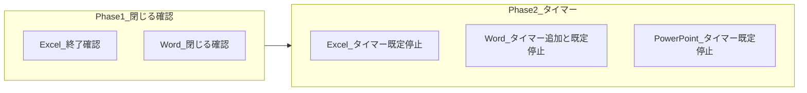

# 閉じる確認とタイマー既定停止の実装計画（task0210）

## 1. アプリバー「閉じる」/「終了」での終了確認（Excel・Wordのみ）

PowerPoint は対象外。Excel と Word の 2 つに終了確認を追加する。

### 1.1 Excel（mos_xaml_app）

- **現状:** アプリバーの「終了」ボタンが `Command="{Binding EndExamCommand}"` にバインドされており、クリックでそのまま `ExecuteEndExam` が実行され、アプリバー閉鎖・メインウィンドウ表示に進む。
- **方針:** 確認はアプリバー側で行い、OK のときだけ ViewModel のコマンドを実行する。

**変更箇所:**

- MOSapp/mos_xaml_app/AppBarWindow.xaml  
  - 「終了」ボタン: `Command="{Binding EndExamCommand}"` を削除し、`Click="EndButton_Click"` に変更。
- MOSapp/mos_xaml_app/AppBarWindow.xaml.cs  
  - `EndButton_Click` を追加: `MessageBox.Show("アプリ自体を終了します。本当にいいですか？", "確認", MessageBoxButton.YesNo, ...)` を表示し、`MessageBoxResult.Yes` の場合のみ `_viewModel.EndExamCommand.Execute(null)` を実行。

### 1.2 Word

Word では「閉じる」ボタンが **AppBarWindow** と **UiTestAppBarWindow** の両方に存在する。プロジェクトを開いたときに表示されるのは **UiTestAppBarWindow**（MOS Word app/MainWindow.xaml.cs 56 行目で new）。両方の Close 処理で同じ確認を入れる。

**変更箇所:**

- MOS Word app/Views/UiTestAppBarWindow.xaml.cs の `CloseButton_Click`（427 行付近）  
  - 先頭で `MessageBox.Show("アプリ自体を終了します。本当にいいですか？", "確認", MessageBoxButton.YesNo, MessageBoxImage.Question)` を表示。
  - 結果が `MessageBoxResult.Yes` の場合のみ、現行の `_timer?.Stop(); SaveAllWordDocumentsAndQuitWord(); this.Close();` を実行。それ以外は何もしない。
- MOS Word app/Views/AppBarWindow.xaml.cs の `CloseButton_Click`（335 行付近）  
  - 上記と同様の確認を追加し、Yes のときだけ `_timer?.Stop(); this.Close();` を実行。

---

## 2. カウントダウンタイマーをデフォルト一時停止＋「タイマーを使用」で有効化

3 アプリとも「プロジェクト一覧画面（MainWindow）」に「タイマーを使用」を置き、デフォルトは未チェック（タイマー停止）。チェック時のみカウントダウンする。

### 2.1 Excel（mos_xaml_app）

- **現状:** MainWindow に「タイマーなし」チェックがあり、チェックで `IsTimerDisabled = true`。デフォルトは未チェック（`IsTimerDisabled = false`）でタイマーが動く。AppBarWindow は `MainWindow.IsTimerDisabled` を見てタイマー開始可否を決めている（AppBarWindow.xaml.cs 357–374 行付近）。
- **変更内容:**
  - **デフォルトを一時停止に:** MainWindow.xaml.cs の `IsTimerDisabled` 初期値を `true` に変更。
  - **UI を「タイマーを使用」に統一:** MainWindow.xaml のチェックボックスを「タイマーなし」→「タイマーを使用」に変更し、**デフォルト未チェック**（`IsChecked="False"`）にする。
  - **ロジックの対応:** チェック時＝タイマー有効 → `IsTimerDisabled = false`、未チェック＝タイマー無効 → `IsTimerDisabled = true`。現在の「タイマーなし」はチェックで無効なので、**Checked/Unchecked の処理を入れ替える**（Checked → `IsTimerDisabled = false`、Unchecked → `IsTimerDisabled = true`）。現在の `NoTimerCheckBox_Checked` が `IsTimerDisabled = true`、`Unchecked` が `false` なので、名前を `TimerCheckBox_Checked` / `TimerCheckBox_Unchecked` にし、中身を上記の通りに入れ替える。

### 2.2 Word（MOS Word app）

- **現状:** MainWindow にタイマー用チェックがなく、UiTestAppBarWindow / AppBarWindow でタイマーが無条件に開始している（UiTestAppBarWindow.xaml.cs 227 行、AppBarWindow.xaml.cs 245 行で `_projectTimer.Start()`）。
- **変更内容:**
  - **MainWindow に「タイマーを使用」を追加:** MainWindow.xaml のヘッダー右側（採点・一時停止チェックの近く）に、Excel/PowerPoint と同様の「タイマーを使用」チェックボックスを追加。`IsChecked="False"`（デフォルト未チェック）。
  - **MainWindow.xaml.cs:** 静的プロパティ `public static bool IsTimerDisabled { get; private set; } = true;` を追加。Checked で `IsTimerDisabled = false`、Unchecked で `IsTimerDisabled = true`。
  - **UiTestAppBarWindow.xaml.cs:** `InitializeTimer` / `InitializeProjectTimer` で、タイマーを `Start()` する前に `MainWindow.IsTimerDisabled` を参照し、`true` の場合は開始しない（Excel の AppBarWindow と同様）。`Timer_Tick` / `ProjectTimer_Tick` 内でも `IsTimerDisabled` のときはカウントしない／停止するようにする。
  - **AppBarWindow.xaml.cs（Word）:** 上記と同様に、タイマー開始を `MainWindow.IsTimerDisabled` で制御。既存の一時停止/再開 UI がある場合は、その挙動と整合させる（無効時は開始しない、有効時のみ開始）。

### 2.3 PowerPoint（Mos PowerPoint Mogi App）

- **現状:** MainWindow に「タイマーを使用する」チェックがあり、`IsChecked="True"`、`IsTimerDisabled = false` で、デフォルトでタイマーが動く（MainWindow.xaml 109 行、MainWindow.xaml.cs 27 行）。
- **変更内容:**
  - MainWindow.xaml.cs: `IsTimerDisabled` の初期値を `true` に変更。
  - MainWindow.xaml: チェックボックスの `IsChecked="True"` を `IsChecked="False"` に変更。

これで 3 アプリとも「プロジェクト一覧で『タイマーを使用』にチェックしたときだけカウントダウンする」挙動になる。

---

## 実装順序のイメージ

1. 先に Excel・Word のアプリバー「閉じる」/「終了」での終了確認を実装。
2. 続けて Excel → Word → PowerPoint の順で、タイマーをデフォルト停止＋「タイマーを使用」で有効化する変更を実施。

---

## 注意事項

- Excel の「終了」は Command をやめて Click にすると、レビューページなど他から `EndExamCommand` を呼ぶ場合は従来どおり確認なしで終了する。確認が必要なのは「アプリバーの終了ボタン」のみとするため、この扱いで問題ない。
- Word の UiTestAppBarWindow は、MainWindow から `new` される時点で `IsTimerDisabled` が読まれる。プロジェクト一覧で後からチェックを入れても、既に開いているアプリバーのタイマーは、既存の「一時停止/再開」UI や、同様の仕組みで有効化する必要がある場合は、既存ロジック（フォーカス復帰時など）と整合させる。
