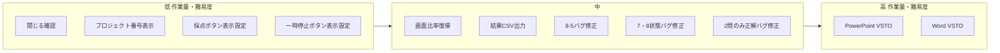

# タスク一覧（作業量・難易度の低い順）

以下の順で実施することを推奨します。番号は元のタスクの識別用です。

---

## 1. 「閉じる」ボタンで終了確認を表示する（元タスク2）

**作業量:** 小  
**難易度:** 低  

- アプリバーまたはメインウィンドウの「閉じる」クリック時に、`Closing` イベントでキャンセルし、`MessageBox` で「アプリ自体を終了します。本当にいいですか？」を表示。OK なら終了、キャンセルなら `e.Cancel = true`。
- 対象: 表紙／Excel／Word／PowerPoint の各アプリで、終了経路が1箇所にまとまっていれば1箇所、複数なら各所に同様の処理を追加。

---

## 2. アプリバーに「現在のプロジェクト番号/総プロジェクト数」を表示する（元タスク5）

**作業量:** 小  
**難易度:** 低  

- アプリバー上の表示テキストを、「現在のプロジェクト番号 / 総プロジェクト数」の形式に変更するだけのUI変更。
- 対象: mos_xaml_app の AppBarWindow（`MOSapp/mos_xaml_app/AppBarWindow.xaml`）、MOS Word app の AppBarWindow（`MOSapp/MOS Word app/Views/AppBarWindow.xaml`）、PowerPoint 側の AppBar 相当。既にプロジェクト番号や総数を持っているならバインド先を変える程度。

---

## 3. 採点ボタンをデフォルト非表示にし、プロジェクト一覧画面に「採点ボタンの表示」を追加（元タスク3）

**作業量:** 小～中  
**難易度:** 低  

- 採点ボタンの表示/非表示を保持する設定（例: プロジェクト設定またはユーザー設定）を追加し、デフォルトは非表示。
- プロジェクト一覧が表示されている画面に「採点ボタンの表示」用チェックボックスまたはトグルを追加し、それで採点ボタンの表示を切り替え。
- Excel / Word / PowerPoint で同じパターンなら、各アプリの AppBar と一覧画面に同様の変更を適用。

---

## 4. 一時停止ボタンをデフォルト非表示にし、プロジェクト一覧画面に「一時停止ボタンの表示」を追加（元タスク4）

**作業量:** 小～中  
**難易度:** 低  

- 上記「採点ボタン」と同様。一時停止ボタンの表示/非表示を設定で持ち、デフォルト非表示。プロジェクト一覧画面に「一時停止ボタンの表示」用のトグルを追加。
- 実装パターンはタスク3と共通化可能。

---

## 5. Office とアプリバーの初期画面比率を記憶し、Office のサイズ変更時に自動で戻す（元タスク1）

**作業量:** 中  
**難易度:** 中  

- 起動時または「初期」とみなすタイミングで、アプリバーと Office ウィンドウのサイズ・比率を記録。
- Office のウィンドウサイズ変更を検知（Win32 のリサイズイベントやタイマーでのポーリングなど）し、変更後に記録した比率へアプリバー／Office のサイズを戻す処理を実行。
- 既存のリサイズ・配置ロジック（例: `MOSapp/mos_xaml_app/References/resize/` 周り）の有無を確認し、その上に「比率復帰」を載せる形が現実的。

---

## 6. 結果表示後に CSV で間違えた部分を出力し、「結果の表示」ボタンで自動書き出し（元タスク8）

**作業量:** 中  
**難易度:** 中  

- Excel / Word / PowerPoint の「結果の表示」ボタン押下時に、間違えた問題・タスクを CSV に書き出し、必要ならそのファイルを開くまたはパスを表示。
- 各アプリの結果画面／ResultWindow で、既存の結果データから「不正解」のみを抽出し、共通の CSV フォーマット（例: プロジェクトID, タスク番号, 問題文要約, 正誤 など）で保存。
- 3アプリ分の実装が必要だが、フォーマットと書き出しロジックを揃えれば流用可能。

---

## 7. Excel 演習 8-5 が常に不正解になる現象の調査・修正（元タスク9）

**作業量:** 中  
**難易度:** 中  

- 演習 8-5 用のチェッカー（例: `MOSapp/mos_xaml_app/Libraries/Group2/` 内の該当クラス）と、採点呼び出し経路を特定。
- 正解条件・期待値と実際の判定ロジックを比較し、条件の誤りや参照セル/シートのずれを修正。再ビルド後、8-5 のみ正解ケースでテスト。

---

## 8. プロジェクト7・8 を解いたのに初期状態のまま採点される現象の調査・修正（元タスク11）

**作業量:** 中  
**難易度:** 中  

- 採点時に「どのプロジェクトのファイルを読んでいるか」「プロジェクト切り替え時に状態が正しく保存/復元されているか」を確認。
- プロジェクトIDやファイルパスの受け渡し、ExamResultStorage やプロジェクト選択状態の保持箇所を追い、7・8 が初期のままになる原因（別プロジェクトのファイルを参照している、状態が上書きされている等）を特定して修正。

---

## 9. Excel 採点で2問しか正解にならない現象の調査・修正（元タスク10）

**作業量:** 中～大  
**難易度:** 中～高  

- 採点ループやタスク数・プロジェクト数の扱い、各タスクの正誤集計方法を確認。2問だけ正解になる条件（先頭2問だけ見ている、ループ break の誤り、別プロジェクトの結果を参照している等）を切り分け。
- ログやブレークポイントで「何問目まで評価しているか」「どのチェッカーが呼ばれているか」を確認し、原因に応じて採点フローまたはチェッカー呼び出しを修正。

---

## 10. PowerPoint 用 VSTO の作成と正誤判定の実装（元タスク6）

**作業量:** 大  
**難易度:** 高  

- PowerPoint 用 VSTO アドインを新規作成。ボタンクリックや選択変更などのイベントをログ出力。
- スライド上のプレースホルダー・図形の位置やテキストを取得し、問題ごとの正解条件と照合する採点ロジックを実装。現状「正誤判定はできていない」ため、仕様策定から必要。
- 既存の PowerPoint アプリ（`MOSapp/Mos PowerPoint Mogi App/`）の採点呼び出しと、VSTO から渡す結果の形式を合わせる必要あり。

---

## 11. Word 用 VSTO の作成と正誤判定の実装（元タスク7）

**作業量:** 大  
**難易度:** 高  

- Word 用 VSTO アドインを新規作成。図形の位置やボタン操作などをログ出力。
- 文書内のオブジェクト位置・内容を取得し、問題ごとの正解条件と照合する採点ロジックを実装。Word の DOM とイベントモデルに合わせた実装が必要。
- 既存の MOS Word app（`MOSapp/MOS Word app/`）の採点フローと連携する形で結果を返す必要あり。

---

## 実施順序のイメージ

- **まず実施:** 1 → 2 → 3 → 4（UI・挙動の小さな変更で効果が分かりやすい）。
- **次:** 5, 8（機能追加）。7, 8, 9 はバグ修正のため、発生再現手順が分かっていれば並行しやすい。
- **最後:** 10, 11（VSTO 新規作成と採点ロジックは依存が多く、他タスクの安定後が望ましい）。

---

## 注意

- バグ修正（7, 9, 10, 11）は再現手順や環境（Excel/Word のバージョン、問題データ）が分かっていると調査がしやすいです。
- VSTO（6, 7）は Office のバージョンやインストール形態に依存するため、環境の前提を揃えてから着手することを推奨します。
